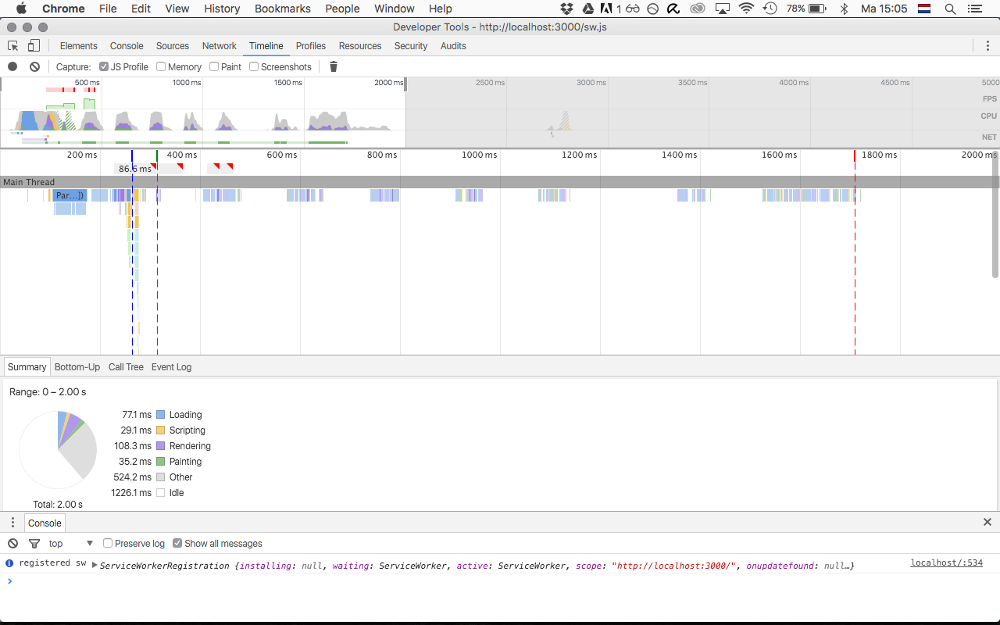
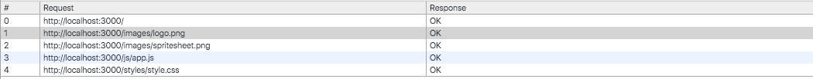
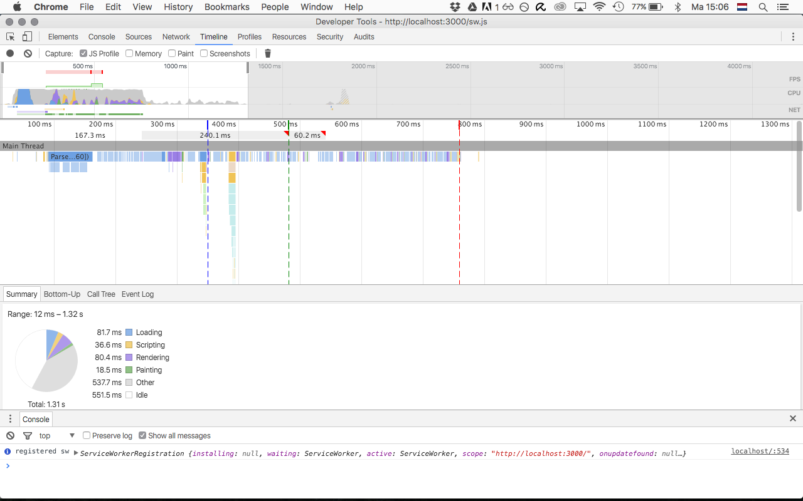

##Jake Archibald on Performance & Service Worker

#####Don't rely on javascript for al the rendering
add async to the script tag:
```
<script src="app.js" async></script>
```
#####Render only the styles needed for the first render

[use loadCSS](https://github.com/filamentgroup/loadCSS) 
```
<script>
	function loadCSS() { ... }
	function onloadCSS() { ... }
</script>
<main class="article" style="display:none">
	<script>
		onloadCSS(loadCSS('style.css'), function() {
			document.querySelector('.article').style.display = '';
		});
	</script>
	<noscript>
		<link rel="stylesheet" href="style.css">
	</noscript>
</main>

##### Use a service worker
##### Using Stream service api 
##### Add "read offline" button for the user


#Performance test
#### Settings
Browser: Chrome Canary


#### start state 

DOM: 0.264s  
First Paint: 0.314s  
Load event: 1.71s  

;

#### Added caching files

Files cached:
* index.html
* app.js
* style.css
* logo.png
* spritesheet.png
;

DOM: 0.350s  
First Paint: 0.482s  
Load event: 0.795s  

;


