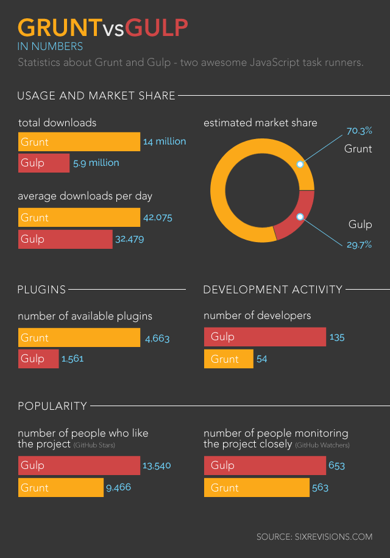

#Task Managers

##Grunt & Gulp



Gulp and Grunt are two big taskmanagers available nowadays. There are two main differences between the taskmanagers:

* How you set up the tasks. Gulp is stream-based, grunt is configration-based.
* How they execute the given tasks. Grunt runs task after task while Gulp try's to run as much tasks as possible at the same time.

There is also a difference in syntax between Gulp and Grunt. Gulp's syntax overall is easier. You can create tasks by 'piping' in all the processes. Like this:
```
gulp.task('scripts', function() {
    return gulp.src('./public/js/*.js')
        .pipe(concat('all.js'))
        .pipe(gulp.dest('./public/dist/js'))
        .pipe(rename('all.min.js'))
        .pipe(uglify())
        .pipe(gulp.dest('./public/dist/js'));
});
```
The syntax of creating configuration file with tasks is much shorter and cleaner with Gulp then with Grunt. Gulps needs less code for the same processes.   

Grunt configuration file example:  

```
module.exports = function(grunt) {
  // Report the task-execution time in the command line
  require('time-grunt')(grunt);
  // Task configuration
  grunt.initConfig({
    pkg: grunt.file.readJSON('package.json'),
    // Combine all CSS files found inside the src directory
    concat_css: {
      dist: {
        src: ['src/*.css'],
        dest: 'css/styles.css'
      }
    },
    // Minify the stylesheet
    cssmin: {
      target: {
        // Write the minified file in the css directory
        files: [{
          'css/styles.min.css': ['css/styles.css']
        }]
      }
    }
  });
  // Load the plugins
  grunt.loadNpmTasks('grunt-concat-css');
  grunt.loadNpmTasks('grunt-contrib-cssmin');
  // Use `grunt` command to run the task
  grunt.registerTask('default', ['concat_css', 'cssmin']);
}
```

Gulp configuration file example:  
```
// Load the plugins
var gulp = require('gulp');
var concatenate = require('gulp-concat-css');
var minify = require('gulp-cssmin');
var duration = require('gulp-duration');
// Task configuration
gulp.task('default', function() {
  gulp.src('src/*.css')
  // Combine all CSS files found inside the src directory
  .pipe(concatenate('styles.min.css'))
  // Minify the stylesheet
  .pipe(minify())
  // Report the task-execution time in the command line
  .pipe(duration('Execution Time: '))
  // Write the minified file in the css directory
  .pipe(gulp.dest('css/'));
});
// Use `gulp` command to run the task
```


Besides the differences in syntax of both taskmanagers, there is also difference in speed.
Gulp is much faster at performing these tasks then Grunt. 

Zander Martineau made a speed comparison test of Grunt vs. Gulp. He similarly reports that Gulp was able to complete tasks quicker than Grunt:


###Winner: Gulp
Mostly because of the syntax i decided to use Gulp. As a beginner i think as a beginner it is easier to understand what is happening with Gulp rather than Grunt.

sources:  
[Grunt Vs Gulp](http://sixrevisions.com/web-development/grunt-vs-gulp/)  
[Speed testing Gulp & Grunt](http://tech.tmw.co.uk/2014/01/speedtesting-gulp-and-grunt/)


## Optimizing HTTP requests with Gulp
###Start state

DOM: 0.681s  
First Paint: 1.01s  
Load event: 2.10s  

### Concatenate & minify JS, Minify CSS, Optimize Images

DOM: 0.818s  
First Paint: 1.23s  
Load event: 2.28s  

## Web font Optimalisation 

###Font Face Observer

DOM: 0.867s  
First Paint: 1.16s  
Load event: 1.99s  

##Conclusion

Concatenating and minfifying files should have a positive effect on the performance. But in this case we have a very small project: only 2 js files and 1 css files. Thats probably why there is no improvement in speed noticable after concatenating, minifien JS & CSS + optimizing images. 

But the Font Face observer made a small improvent in performance:  
DOM: 0.49s slower  
First Paint: 0.07s faster  
Load event: 0.29s faster  

##Overal conclusion

With all the performance adjustments the looklive website has significant faster load time then before. Some adjustments didn't have much influence on the performance. An example of this was the Service Worker, the page rendered 0.33s slower than without the SW. After rewriting the HTML/CSS/JS and removing jQuery the page had a Load event time of 0.86s. After implementing the SW the Load event was 2.52!!!. But the test results are not completely reliable in my opinion. The Timeline tool of Chrome gives sometimes highly variable results.

######Start state  
DOM: 0.87s   
First Paint: 1.25s   
Load event: 3s

######After first week adjustments (HTML/CSS/JS/IMG)  
DOM: 0.22s   
First Paint: 0.25s   
Load event: 0.86s

######After implementing Service Worker  
DOM: 0.769s   
First Paint: 1.06s   
Load event: 2.52s

######After Optimising HTTP requests  
DOM: 0.867s   
First Paint: 1.16s   
Load event: 1.99s

######Overal profit on performance
DOM: 0s
First Paint: 0.09s
Load event: 1.01s

[Digital Ocean Server](https://webdevelopment.work3gether.com/)


